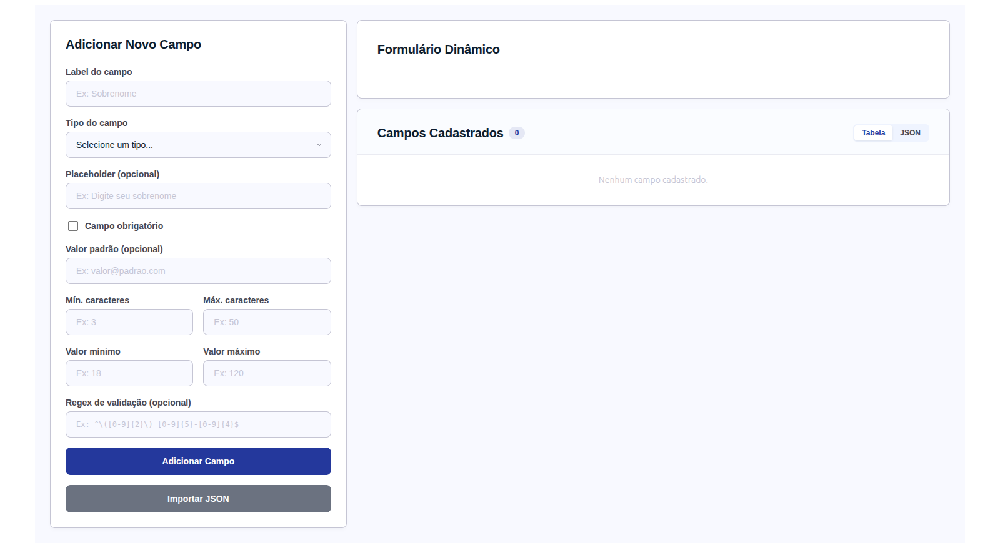
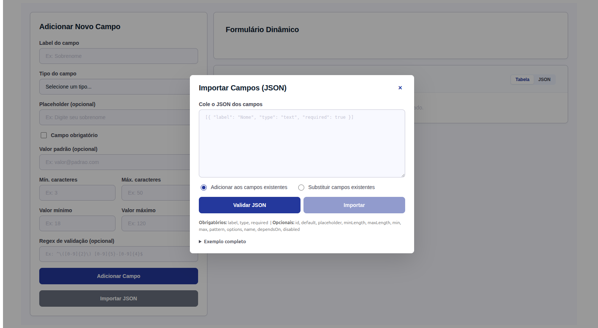
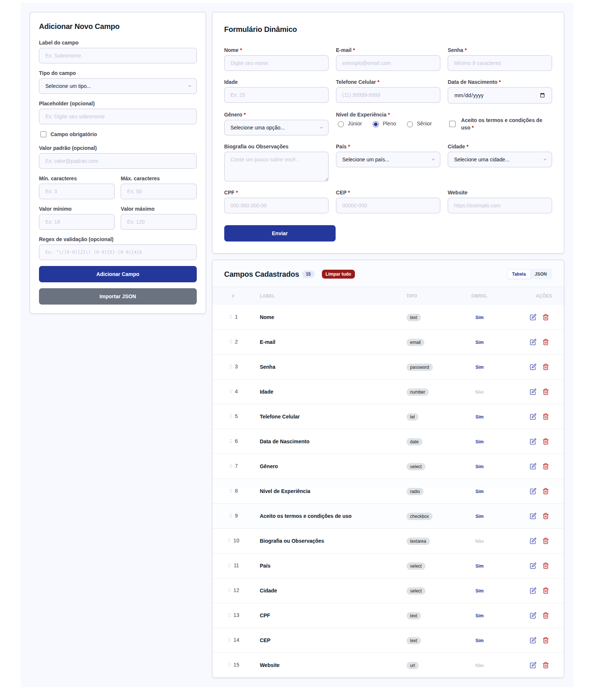

<picture>
  <source media="(prefers-color-scheme: dark)" srcset="public/1.png">
  
</picture>

<br>

<div align="center">
  <h1>Dynamix</h1>
  <p><strong>Construtor de Formulários Dinâmicos</strong></p>
  <p>
    
    
    
    
    
  </p>
</div>

---

## Visão Geral

**Dynamix** é uma aplicação web moderna para criação, edição e visualização de formulários dinâmicos. Com uma interface limpa e responsiva, permite que desenvolvedores e analistas construam formulários complexos sem escrever uma linha de código HTML.

O painel esquerdo concentra as ferramentas de construção (adicionar campos, importar JSON), enquanto o painel direito exibe a pré-visualização ao vivo do formulário e a lista de campos cadastrados com suporte a arrastar e soltar.

---

## Funcionalidades

### Construtor Visual de Campos
- Adicione campos de diversos tipos: texto, email, senha, número, telefone, data, select, radio, checkbox e textarea
- Configure label, placeholder, valor padrão, validações (min/max length, min/max value, regex)
- Defina opções personalizadas para campos do tipo select e radio
- Marque campos como obrigatórios ou opcionais

### Reordenação Drag & Drop
- Reordenar campos na tabela via arrastar e soltar com @dnd-kit
- Feedback visual durante o arrasto com opacidade e cursor personalizado

### Importação de Campos via JSON
- Importe lotes de campos usando um JSON estruturado
- Dois modos de importação: adicionar (append) ou substituir (replace)
- Validação contra schema Zod com feedback visual (verde/vermelho)
- Pré-visualização dos campos parsed antes de importar
- Accordion com formato esperado e lista de campos obrigatórios/opcionais

### Edição e Exclusão
- Edite qualquer campo existente via modal dedicado com os mesmos campos do construtor
- Exclua campos individualmente com botão de ação
- Limpar tudo com confirmação para remover todos os campos de uma vez

### Pré-visualização em Tempo Real
- O formulário é renderizado ao vivo no painel direito
- Validação dinâmica com Zod + react-hook-form
- Mensagens de erro exibidas abaixo de cada campo
- Suporte a campos com dependência (ex.: país -> cidades) com loading simulado

### Visualização em Tabela / JSON
- Alterne entre visualização Tabela (com drag-and-drop) e JSON (código formatado)
- Badge com contagem total de campos
- Chips coloridos para identificar o tipo de cada campo

### Design System
- Tema com paleta de cores, tipografia (Manrope + Inter) e cantos arredondados consistentes
- Sistema de design gerenciado via Stitch, com tokens centralizados em styled-components
- Modal, Overlay, Tabs, Cards, Badges e todos os elementos seguem o mesmo guia de estilo

---

## Screenshots

| Construtor e Pré-visualização | Lista de Campos com Drag & Drop | Importação JSON |
|---|---|---|
|  |  |  |

## Demonstração em Vídeo

[Veja o vídeo de demonstração](public/preview_app.webm)

---

## Tecnologias

| Categoria | Tecnologia | Versão |
|---|---|---|
| Linguagem | TypeScript | 6.0 |
| Framework | React | 19 |
| Bundler | Vite | 8 |
| Validação | Zod | 4 |
| Formulários | react-hook-form | 7 |
| Estilização | styled-components | 6 |
| Drag & Drop | @dnd-kit | core/sortable/utilities |
| Design Tokens | Stitch | -- |

---

## Arquitetura

```
src/
  types/              Interfaces e tipos (FormField, FieldOption, etc.)
    form.ts
  constants/          Dados estáticos (FIELD_TYPES, INITIAL_FIELDS, CITY_DB)
    fields.ts
  schemas/            Schemas Zod para validação
    fieldSchema.ts        Schema do formulário de adicionar campo
    dynamicFieldSchema.ts Schema dinâmico gerado a partir dos campos
    importFieldSchema.ts  Schema para validação de JSON importado
  hooks/              Lógica de estado
    useDynamicForm.ts     Hook principal (CRUD, reorder, import)
  componentes/        Componentes React
    FieldBuilder.tsx      Formulário para adicionar novos campos
    FieldRenderer.tsx     Renderiza cada campo no preview
    DynamicForm.tsx       Formulário dinâmico com validação
    FieldList.tsx         Tabela com drag-and-drop e toggle JSON
    FieldEditDialog.tsx   Modal de edição de campo
    FieldImportDialog.tsx Modal de importação JSON
  styles.ts           Design tokens e styled-components
  App.tsx             Orquestrador principal
```

### Princípios

- SOLID: tipos, constantes, schemas, hooks e componentes separados por responsabilidade
- Nomes em inglês para variáveis, objetos e propriedades (conforme regra do projeto)
- UI em português (público-alvo brasileiro)
- Nenhum comentário em código de produção

---

## Como Executar

```bash
git clone https://github.com/amxxavier/dynamix.git
cd dynamix
npm install
npm run dev
```

Acesse em [http://localhost:5173](http://localhost:5173)

### Comandos Disponíveis

| Comando | Descrição |
|---|---|
| `npm run dev` | Inicia servidor de desenvolvimento Vite |
| `npm run build` | Compila TypeScript e faz o bundle de produção |
| `npm run preview` | Pré-visualiza o build de produção |
| `npm run lint` | Executa ESLint no projeto |

---

## Estrutura de Dados — Import JSON

```json
[
  {
    "label": "Nome",
    "type": "text",
    "required": true,
    "default": "",
    "placeholder": "Digite seu nome",
    "minLength": 3,
    "maxLength": 50
  }
]
```

**Campos obrigatórios:** `label`, `type`, `required`
**Campos opcionais:** `id`, `default`, `placeholder`, `minLength`, `maxLength`, `min`, `max`, `pattern`, `options`, `name`, `dependsOn`, `disabled`

---

## Licença

Distribuído sob a licença MIT. Veja `LICENSE` para mais informações.
